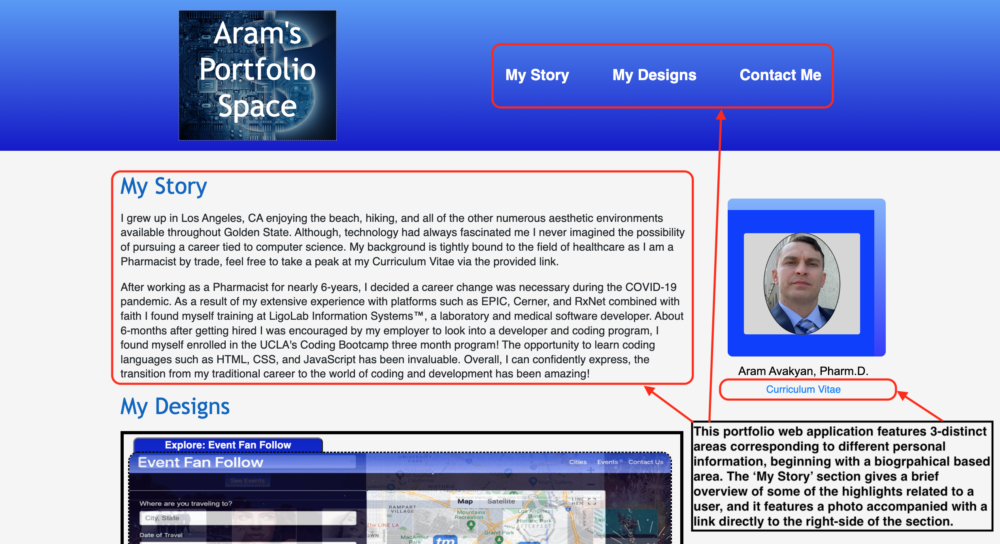
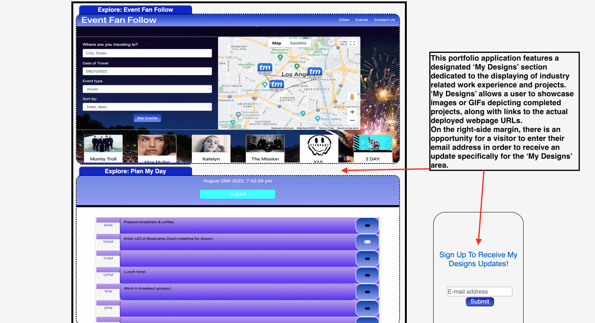
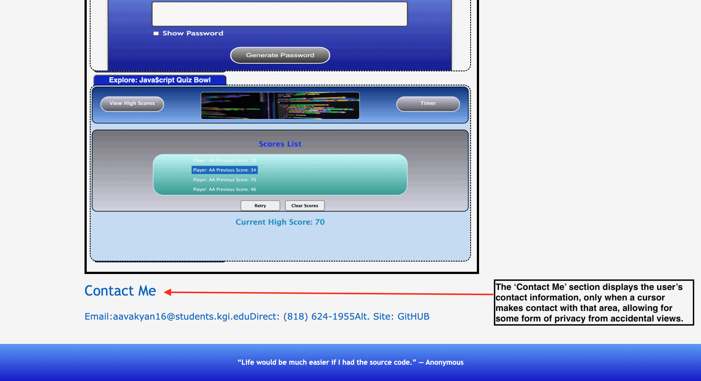

# My-Portfolio-Space

## An application comprised of an overview containing personal and professional credentials.

### Brief Description:

This portfolio of work showcases my skills and talents to employers looking to fill a part-time or full-time position. As a result of developing and coding this portfolio, my strongest work will be highlighted along with my taste in numerous styling aspects. An effective portfolio highlights your strongest work as well as the thought processes behind it. Having this portfolio successfully deployed and consistently updated will allow me to pursue employment opportunities shortly after bootcamp completion.

## Acceptance Criteria:

Here are the critical requirements necessary to develop a portfolio that satisfies a typical hiring manager’s needs:

```
GIVEN I need to sample a potential employee's previous work
WHEN I load their portfolio
THEN I am presented with the developer's name, a recent photo or avatar, and links to sections about them, their work, and how to contact them
WHEN I click one of the links in the navigation
THEN the UI scrolls to the corresponding section
WHEN I click on the link to the section about their work
THEN the UI scrolls to a section with titled images of the developer's applications
WHEN I am presented with the developer's first application
THEN that application's image should be larger in size than the others
WHEN I click on the images of the applications
THEN I am taken to that deployed application
WHEN I resize the page or view the site on various screens and devices
THEN I am presented with a responsive layout that adapts to my viewport
```

## Mock Up

Below is a GIF and images of Aram's Portfolio Space along with the URLs associated with the webpage and GitHUB Repository:

Deployed Webpage URL: https://aasports89.github.io/my-portfolio-space/

GitHUB Repository URL: https://github.com/AASports89/my-portfolio-space

### Portfolio Gif


### Header & Nav 



### Body & Attributes



### Footer & 'Contact Me' Nav 




## Webpage Specifications:

* Utilization aspects of semantic organization

* Uses of parent & child element

* Nav links usage to direct a user to the appropriate webpage sections & information

* Container & section usage in order to compartmentalize information to make it easy for the browser to locate specific info

* The usage of the form function in order to navigate to a specific URL & to subscribe for updates regarding future projects